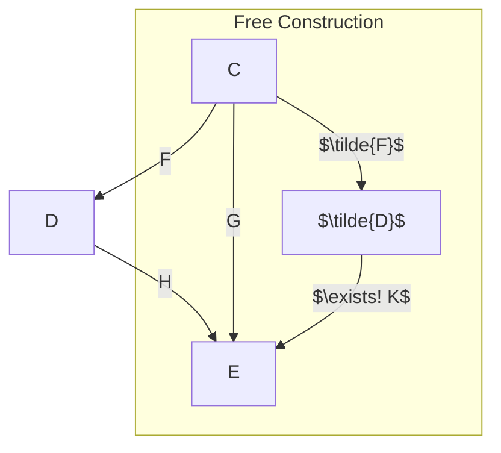

# Free Monoidal Functor Fundamentals

## Question

What is a "free monoidal functor" and are such things unique?

## Answer

A free monoidal functor is a fundamental construction in category theory that provides the "most general" or "least constrained" way to turn any functor into a monoidal functor.

### Definition

Given a functor $F: C \to D$ between monoidal categories $(C, \otimes_C, I_C)$ and $(D, \otimes_D, I_D)$, the **free monoidal functor** on $F$ is a monoidal functor $\tilde{F}: C \to \tilde{D}$ where:

- $\tilde{D}$ is constructed as the "free monoidal category" generated by $D$.
- $\tilde{F}$ extends $F$ in the minimal way necessary to preserve monoidal structure.
- $\tilde{F}$ satisfies a universal property: any monoidal functor from $C$ that agrees with $F$ on objects factors uniquely through $\tilde{F}$.

### Construction

The free monoidal functor is built by:

1.  **Taking formal tensor products**: Creating expressions like $F(A) \otimes F(B) \otimes F(C)$ for objects in $C$.
2.  **Adding minimal coherence**: Only imposing the associativity and unit laws required for monoidal structure.
3.  **No additional relations**: Not identifying any tensor products unless forced by monoidal axioms.

For example, if $F: \text{Set} \to \text{Set}$ is any functor, the free monoidal functor $\tilde{F}$ would map:

- **Objects** $A$ to formal expressions built from $F(A)$ using $\otimes$.
- **Morphisms** to formal combinations preserving the monoidal structure.

### Uniqueness

Free monoidal functors are **unique up to unique isomorphism**. This follows from the universal property:

- **Existence**: There always exists a free monoidal functor for any base functor.
- **Uniqueness**: If $\tilde{F}_1$ and $\tilde{F}_2$ are both free monoidal functors on $F$, then there exists a unique monoidal isomorphism between them that commutes with $F$.

This uniqueness is categorical—the free monoidal functor is determined by its universal property, and any two objects satisfying this property must be isomorphic in a canonical way.

### Relationship to Free Objects

Free monoidal functors are part of a broader pattern of "free" constructions in mathematics, similar to:

- **Free groups** (adding minimal relations to make a set into a group)
- **Free vector spaces** (formal linear combinations)
- **Free categories** (adding minimal composition structure)

The "freeness" captures the idea of imposing exactly the structure required, with no unnecessary constraints.

## Question

Give a more pedagogical explanation, but not elementary

## Answer

### Free Monoidal Functors: A Pedagogical Approach

Understanding free monoidal functors requires building intuition about what "freeness" means in the monoidal context and why we need this construction.

#### The Problem: When Functors Don't Preserve Structure

Start with this fundamental tension: suppose you have a functor $F: C \to D$ between monoidal categories, but $F$ is not monoidal. This means:

- $F$ might not preserve the unit: $F(I_C) \neq I_D$
- $F$ doesn't preserve tensor products: $F(A \otimes_C B)$ is unrelated to $F(A) \otimes_D F(B)$

Yet you often need $F$ to interact well with monoidal structure. The naive approach of simply declaring $F(A \otimes_C B) = F(A) \otimes_D F(B)$ generally fails because it won't respect the coherence conditions (associativity, unit laws).

#### The Insight: Build the Minimal Extension

The free monoidal functor solves this by constructing a new target category where we can impose monoidal structure on $F$ without contradiction.

**Key Idea**: Instead of forcing $F$ to be monoidal in $D$, we build a new category $\tilde{D}$ where:

- $F$ naturally becomes monoidal when viewed as $\tilde{F}: C \to \tilde{D}$.
- $\tilde{D}$ contains $D$ as a "subcategory" but adds formal tensor products.
- The only relations in $\tilde{D}$ are those forced by monoidal coherence.

#### Construction Details

**Step 1: Objects of $\tilde{D}$**

Objects are formal expressions built from objects of $D$ using the tensor product:

- All objects from $D$
- Formal tensor products like $A \otimes B \otimes C$ where $A,B,C \in D$
- The monoidal unit $I$

**Step 2: Morphisms of $\tilde{D}$**

Morphisms are generated by:

- All morphisms from $D$
- Coherence isomorphisms: associators $(A \otimes B) \otimes C \cong A \otimes (B \otimes C)$ and unitors $I \otimes A \cong A$
- Functoriality: if $f: A \to A'$ and $g: B \to B'$ in $D$, then $f \otimes g: A \otimes B \to A' \otimes B'$

**Step 3: Relations in $\tilde{D}$**

The only relations are MacLane's coherence conditions:

- Pentagon identity for associators
- Triangle identity relating associators and unitors
- Naturality of coherence isomorphisms

This is crucial: we add no extra relations beyond what monoidal coherence demands.

#### The Universal Property

The free monoidal functor $\tilde{F}: C \to \tilde{D}$ satisfies:

**Universal Property**: For any monoidal functor $G: C \to E$ and any functor $H: D \to E$ such that $G = H \circ F$ on objects, there exists a unique monoidal functor $K: \tilde{D} \to E$ such that $G = K \circ \tilde{F}$.



This means $\tilde{F}$ is the "most general" way to make $F$ into a monoidal functor.

#### Why This Works: The Coherence Theorem

MacLane's coherence theorem ensures that all formal expressions we build in $\tilde{D}$ behave consistently. Specifically:

- Any two ways of parenthesizing a tensor product $A_1 \otimes A_2 \otimes ... \otimes A_n$ give canonically isomorphic results.
- These isomorphisms are coherent (they compose in the expected way).

This means our "formal" construction actually has well-defined mathematical meaning.

#### Concrete Example: Sets to Vector Spaces

Consider the inclusion functor $F: \text{Set} \to \text{Vect}$. This isn't monoidal because:

- Cartesian product in $\text{Set}$ vs tensor product in $\text{Vect}$
- Different unit objects

The free monoidal functor $\tilde{F}: \text{Set} \to \tilde{\text{Vect}}$ works by:

- $\tilde{F}(S)$ = formal span of $S$ (free vector space on $S$)
- $\tilde{F}(S \times T) = \tilde{F}(S) \otimes \tilde{F}(T)$ in $\tilde{\text{Vect}}$
- $\tilde{\text{Vect}}$ contains formal tensor products that may not exist in $\text{Vect}$

#### Uniqueness: Why It Matters

The uniqueness (up to unique isomorphism) means:

- The construction is canonical—independent of arbitrary choices.
- Any two "free monoidal extensions" of the same functor are essentially the same.

This justifies talking about "**the**" free monoidal functor.

#### Applications and Intuition

Free monoidal functors appear in:

- **Algebraic topology**: Making functors into monoidal functors for multiplicative structures.
- **Computer science**: Semantics of programming languages with tensor types.
- **Representation theory**: Extending functors between representation categories.

The key insight is that "freeness" here means "adding exactly the monoidal structure required, with no additional constraints." It's the categorical way of saying "do the obvious thing, but do it correctly."

## Question

When I say "List is the free monoidal functor", what does that refer to?

## Answer

When you say "List is the free monoidal functor," you're referring to a specific and important construction in functional programming and category theory.

### The Correct Interpretation

"List is the free monoidal functor" typically means:

> The `List` functor, `List: Set → Set`, is the free monoidal functor when `Set` is viewed as a monoidal category under **disjoint union** (coproduct) rather than cartesian product.

Here's the key insight:

#### Base Functor

Start with the identity functor `Id: Set → Set`, but now consider:

- **Source**: `(Set, +, ∅)` - sets with disjoint union as the tensor product.
- **Target**: We need to construct the free monoidal category.

#### The Construction

The `List` functor emerges as:

- `List(A)` = The set of all finite sequences (lists) of elements from `A`.
- **Monoidal structure**: List concatenation (`++`).
- **Unit**: The empty list (`[]`).

#### Why This Is "Free"

- **Universality**: Any function `f: A → B` extends to a unique monoidal functor `List(f): List(A) → List(B)` (which is just `map f`).
- **Minimal relations**: In `List(A)`, we only have the relations forced by monoidal laws:
    - **Associativity**: `(xs ++ ys) ++ zs = xs ++ (ys ++ zs)`
    - **Unit laws**: `[] ++ xs = xs = xs ++ []`
- **No additional constraints**: We don't identify lists unless forced by monoidal coherence.

#### The Universal Property

For any monoidal functor $F: (\text{Set}, +, \emptyset) \to (C, \otimes, I)$, there's a unique way to factor it through `List`.

This means: to define a monoidal functor out of `(Set, +, ∅)`, it suffices to say where you send individual elements—the monoidal structure forces how you handle finite collections.

### Alternative Interpretation: Endofunctor Perspective

Sometimes "List is the free monoidal functor" refers to:

> `List` is the **free monoid** in the monoidal category of endofunctors on `Set`.

Here:

- **Category**: `[Set, Set]` (the category of endofunctors on `Set`).
- **Monoidal structure**: Functor composition (`∘`).
- `List` is a monoid object because there are natural transformations `List ∘ List → List` (flatten) and `Id → List` (singleton).

### Why This Matters in Programming

This explains why:

- **Lists naturally concatenate**: The `++` operation isn't arbitrary—it's the unique monoidal structure.
- **`map` preserves structure**: `fmap` (or `map`) naturally extends to a monoidal functor.
- **Fold operations are fundamental**: The universal property explains why folding (catamorphisms) is so powerful.

#### Concrete Example

```haskell
-- Any function f: A -> B gives a monoidal functor
map f :: [A] -> [B]

-- It preserves the monoidal structure:
map f (xs ++ ys) == map f xs ++ map f ys
map f [] == []
```

The "freeness" means this is the only way to make such extensions while preserving the monoidal structure—there are no arbitrary choices involved.

So when you say "List is the free monoidal functor," you're identifying `List` as the canonical way to turn sets (with disjoint union) into a structure that naturally supports concatenation with all the expected algebraic properties.