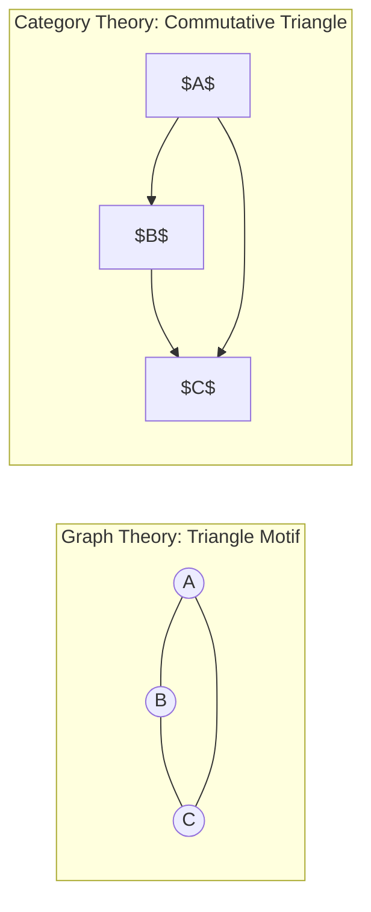

#ai-generated #claude-35-sonnet 

# A Coherent Exploration of Category Theory Concepts

## 1. Diagrams in Category Theory

Diagrams are fundamental to understanding many concepts in category theory, including colimits and monoidal structures. Let's start by exploring what diagrams are and why they're important.

### 1.1 Definition and Intuition

A diagram in a category $C$ is formally defined as a functor $D: J \to C$, where:
- $J$ is called the index category or shape category
- $C$ is the category in which we're working

Intuitively, a diagram can be thought of as a "picture" or a "pattern" of objects and morphisms in a category. It selects certain objects and morphisms from the category $C$ according to the pattern specified by $J$.

### 1.2 Examples of Diagrams

1. Parallel arrows diagram: 
   This represents two morphisms with the same domain and codomain:
   $$
   A \rightrightarrows B
   $$
   Here, $J$ has two objects and two non-identity morphisms between them.

2. Commutative square:
   ```mehrmaid
   graph TD
       A["$A$"] --> B["$B$"]
       A --> C["$C$"]
       B --> D["$D$"]
       C --> D
   ```
   Here, $J$ is a category with four objects and four non-identity morphisms forming a square.

3. Chain diagram:
   This represents a sequence of morphisms:
   $$
   A_1 \to A_2 \to A_3 \to \cdots
   $$
   The index category $J$ here could be the category of natural numbers with morphisms $i \to j$ whenever $i \leq j$.

### 1.3 Finite vs. Infinite Diagrams

A diagram is called finite if its index category $J$ is finite (i.e., has finitely many objects and morphisms). Otherwise, it's called an infinite diagram. This distinction becomes important when we discuss colimits.

### 1.4 Importance of Diagrams

Diagrams are crucial in category theory for several reasons:

a) They allow us to specify patterns and relationships between objects and morphisms in a precise way.
b) They are used to define universal constructions like limits and colimits.
c) They help in visualizing and understanding complex categorical concepts.
d) They provide a way to compare different categories by looking at how certain diagrams behave in each.

### 1.5 Diagram Chasing

"Diagram chasing" is a proof technique in category theory where one follows paths in a diagram, using the commutativity of the diagram to establish equalities between compositions of morphisms.

## 2. Colimits in Category Theory

Now that we understand diagrams, we can explore colimits, which are universal constructions defined in terms of diagrams.

### 2.1 Definition of Colimits

A colimit is a universal cocone for a diagram in a category. More formally:

Given a diagram $D: J \to C$ (where $J$ is a small category and $C$ is the category we're working in), a colimit consists of:

a) An object $\text{colim } D$ in $C$
b) A family of morphisms $(\iota_j: D(j) \to \text{colim } D)_{j \in J}$

such that for any other cocone $(Y, (f_j: D(j) \to Y)_{j \in J})$, there exists a unique morphism $u: \text{colim } D \to Y$ making the following diagram commute for all $j \in J$:

```mehrmaid
graph TD
    A["$D(j)$"]
    B["$\text{colim } D$"]
    C["$Y$"]
    
    A -->|"$\iota_j$"| B
    A -->|"$f_j$"| C
    B -->|"$\exists! u$"| C
```

### 2.2 Importance of of Finite Colimits

While infinite colimits are important in certain contexts, finite colimits are often emphasized for several reasons:

a) Computational feasibility: Finite colimits involve diagrams indexed by finite categories, making them more manageable to compute and work with in practice.

b) Existence in many categories: Many important categories have all finite colimits, but not necessarily all small colimits. For example, the category of finite sets has all finite colimits but not all small colimits.

c) Relationship to algebraic structures: Finite colimits are closely related to algebraic operations. For instance, coproducts (a type of colimit) in the category of groups correspond to free products of groups.

d) Preservation properties: Functors that preserve finite colimits (finitely cocontinuous functors) are more common and often easier to work with than those preserving all small colimits.

e) Connection to geometric intuition: In many geometric contexts, finite colimits correspond to intuitive constructions (e.g., gluing together a finite number of spaces), while infinite colimits can lead to more pathological objects.

f) Computational complexity: In computer science and type theory, finite colimits often correspond to data types that can be effectively constructed and manipulated.

### 2.3 Examples of Finite Colimits

Some important examples of finite colimits include:
- Coproducts (categorical sums)
- Pushouts
- Coequalizers

## 3. Lax Monoidal Categories

With an understanding of diagrams and colimits, we can now explore lax monoidal categories, which involve specific types of diagrams and universal constructions.

### 3.1 Definition

A category is called "lax monoidal" when it is equipped with a tensor product structure that satisfies the monoidal category axioms, but only up to coherent morphisms rather than strict equalities.

### 3.2 Key Components

1. Tensor product: A bifunctor $\otimes: C \times C \to C$ (where $C$ is the category).
2. Unit object: A distinguished object $I$ in $C$.
3. Associator: A natural transformation $\alpha: (A \otimes B) \otimes C \to A \otimes (B \otimes C)$ for all objects $A, B, C$.
4. Left and right unitors: Natural transformations $\lambda: I \otimes A \to A$ and $\rho: A \otimes I \to A$ for all objects $A$.

### 3.3 Distinction from Strict Monoidal Categories

In a lax monoidal category:
- The associator $\alpha$ is not required to be an isomorphism.
- The unitors $\lambda$ and $\rho$ are not required to be isomorphisms.
- The coherence conditions (pentagon and triangle identities) are satisfied as commutative diagrams of morphisms, but these morphisms are not necessarily isomorphisms.

### 3.4 Coherence Conditions

Coherence conditions ensure that all diagrams built from $\alpha$, $\lambda$, and $\rho$ commute, allowing for consistent manipulation of tensor products regardless of the order of operations.

#### 3.4.1 Pentagon Identity

This diagram ensures consistency when reassociating a tensor product of four objects:

```mehrmaid
graph TD
    A["$((A \otimes B) \otimes C) \otimes D$"]
    B["$(A \otimes B) \otimes (C \otimes D)$"]
    C["$A \otimes (B \otimes (C \otimes D))$"]
    D["$(A \otimes (B \otimes C)) \otimes D$"]
    E["$A \otimes ((B \otimes C) \otimes D)$"]
    
    A -->|"$\alpha_{A\otimes B,C,D}$"| B
    B -->|"$\alpha_{A,B,C\otimes D}$"| C
    A -->|"$\alpha_{A,B,C} \otimes 1_D$"| D
    D -->|"$\alpha_{A,B\otimes C,D}$"| E
    E -->|"$1_A \otimes \alpha_{B,C,D}$"| C
```

#### 3.4.2 Triangle Identity

This diagram relates the associator and the unitors:

```mehrmaid
graph TD
    A["$(A \otimes I) \otimes B$"]
    B["$A \otimes (I \otimes B)$"]
    C["$A \otimes B$"]
    
    A -->|"$\alpha_{A,I,B}$"| B
    A -->|"$\rho_A \otimes 1_B$"| C
    B -->|"$1_A \otimes \lambda_B$"| C
```

## 4. Analogy: Diagrams and Graph Motifs

To provide a broader perspective, it's interesting to note that diagrams in category theory are analogous to motifs in graph theory. This analogy helps to illustrate the fundamental nature of pattern recognition across different mathematical disciplines.

### 4.1 Comparison

In graph theory:
- A motif is a small subgraph or pattern that recurs within larger graphs.
- Motifs represent characteristic patterns of interconnections.

In category theory:
- A diagram is a "pattern" of objects and morphisms within a larger category.
- Diagrams represent specific configurations of objects and arrows.

### 4.2 Key Similarities

a) Pattern Recognition: Both motifs and diagrams are about identifying specific patterns within larger structures.
b) Structural Units: Motifs are considered building blocks of complex networks, while diagrams are fundamental units for describing categorical structures.
c) Analysis Tool: In graph theory, studying motifs helps understand network structure and function. In category theory, analyzing diagrams helps understand categorical properties and universal constructions.

### 4.3 Key Differences

a) Directionality: Graph motifs often deal with undirected graphs, while categorical diagrams typically involve directed morphisms.
b) Composition: In graphs, edges are usually not composable, but in categories, morphisms can be composed, which is a crucial aspect of categorical diagrams.
c) Abstraction Level: Graph motifs are often more concrete, representing specific network patterns, while categorical diagrams can represent highly abstract mathematical structures.

### 4.4 Visual Comparison

```mehrmaid
flowchart LR
A --> C
B --> D
C & D --> E
E --> F & G
F --> H
G --> J
subgraph X ["$X$"]
A(("$A$"))
end
subgraph id1 ["$Y$"]
G(("$G$"))
end
subgraph id3 ["$Z$"]
E(("$E$"))
end
C(("$C$"))
D(("$D$"))
F(("$F$"))
B(("$B$"))
H(("$H$"))
J(("$J$"))
```



This analogy highlights how pattern recognition and structural analysis are fundamental across various areas of mathematics, providing valuable insights and intuitions.