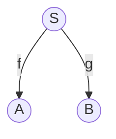
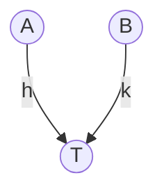

#ai-generated #claude-35-sonnet #category-theory

Let's start with the following concepts. Span. Cospan. Limits. Colimits. Go!

 Certainly! I'll provide a coherent exploration of these fundamental concepts in category theory, starting with spans and cospans, then moving on to limits and colimits. This progression will help us understand how these concepts are related and build upon each other.
 
 ## 1. Spans

A span is a fundamental construction in category theory that generalizes the notion of a relation between two objects.

### 1.1 Definition

In a category $\mathcal{C}$, a span from object $A$ to object $B$ consists of:
- An object $S$ (called the apex of the span)
- Two morphisms: $f: S \to A$ and $g: S \to B$

This is typically represented as a diagram:



### 1.2 Notation

We often denote a span as $(S, f, g)$ or simply $S$ when the morphisms are clear from context.

### 1.3 Examples

1. In the category of sets, a span represents a binary relation between two sets.
2. In the category of groups, a span can represent a group acting on two different sets.

## 2. Cospans

A cospan is the dual notion to a span, obtained by reversing the direction of the morphisms.

### 2.1 Definition

In a category $\mathcal{C}$, a cospan from object $A$ to object $B$ consists of:
- An object $T$ (called the apex of the cospan)
- Two morphisms: $h: A \to T$ and $k: B \to T$

This is typically represented as a diagram:



### 2.2 Notation

We often denote a cospan as $(T, h, k)$ or simply $T$ when the morphisms are clear from context.

### 2.3 Examples

1. In the category of topological spaces, a cospan can represent two spaces embedded in a larger space.
2. In the category of modules over a ring, a cospan can represent two modules mapping into a common module.

## 3. Limits

Limits are universal constructions that generalize several important mathematical concepts.

### 3.1 Definition

Given a diagram $D: J \to \mathcal{C}$ (where $J$ is a small category and $\mathcal{C}$ is our category of interest), a limit of $D$ consists of:

1. An object $\text{lim } D$ in $\mathcal{C}$
2. A family of morphisms $(\pi_j: \text{lim } D \to D(j))_{j \in J}$

such that for any other cone $(X, (f_j: X \to D(j))_{j \in J})$, there exists a unique morphism $u: X \to \text{lim } D$ making the following diagram commute for all $j \in J$:

```mehrmaid
graph TD
    X((X))
    L["lim D"]
    Dj["D(j)"]
    X -->|"$\exists! u$"| L
    X -->|"$f_j$"| Dj
    L -->|"$\pi_j$"| Dj
```

### 3.2 Examples of Limits

1. Product: The limit of a discrete diagram (i.e., a diagram with no morphisms between objects).
2. Pullback: The limit of a diagram of the form $A \to C \leftarrow B$.
3. Equalizer: The limit of a parallel pair of morphisms $f, g: A \rightrightarrows B$.

## 4. Colimits

Colimits are the dual notion to limits, obtained by reversing all the arrows in the definition of a limit.

### 4.1 Definition

Given a diagram $D: J \to \mathcal{C}$, a colimit of $D$ consists of:

1. An object $\text{colim } D$ in $\mathcal{C}$
2. A family of morphisms $(\iota_j: D(j) \to \text{colim } D)_{j \in J}$

such that for any other cocone $(Y, (g_j: D(j) \to Y)_{j \in J})$, there exists a unique morphism $u: \text{colim } D \to Y$ making the following diagram commute for all $j \in J$:

```mehrmaid
graph TD
    Dj["D(j)"]
    C["colim D"]
    Y((Y))
    Dj -->|"$\iota_j$"| C
    Dj -->|"$g_j$"| Y
    C -->|"$\exists! u$"| Y
```

### 4.2 Examples of Colimits

1. Coproduct: The colimit of a discrete diagram.
2. Pushout: The colimit of a diagram of the form $A \leftarrow C \to B$.
3. Coequalizer: The colimit of a parallel pair of morphisms $f, g: A \rightrightarrows B$.

## 5. Relationships

1. Spans and cospans are often used to construct more complex diagrams, which can then be used to define specific limits or colimits.

2. The pullback of a cospan is a span, and dually, the pushout of a span is a cospan.

3. Limits can be thought of as "generalized intersections," while colimits can be thought of as "generalized unions."

4. In the category of sets:
   - The limit of a span is the pullback, which corresponds to the intersection of relations.
   - The colimit of a cospan is the pushout, which corresponds to the union of subsets.

5. Many important mathematical constructions can be viewed as limits or colimits of spans or cospans, showcasing the unifying power of category theory.

</antArtifact>

This exploration covers the four concepts you mentioned - spans, cospans, limits, and colimits - in a logical order. We start with the simpler concepts of spans and cospans, which are often used to construct diagrams. Then we move on to the more complex notions of limits and colimits, which are universal constructions defined on diagrams.

The progression allows us to see how these concepts build upon each other:

1. Spans and cospans are basic constructions involving three objects and two morphisms.
2. Limits and colimits are defined on more general diagrams, which can include spans and cospans as special cases.
3. The relationship section at the end ties everything together, showing how spans and cospans relate to specific types of limits and colimits (pullbacks and pushouts).

This structure provides a coherent flow from simpler to more complex ideas, while also highlighting the interconnections between these fundamental category theory concepts. Would you like me to elaborate on any specific part of this explanation?

### Can you give real world examples of spans and cospans and give a more pedagogical explanation of these objects?

 I'd be happy to provide some real-world examples of spans and cospans along with a more pedagogical explanation. Let's start with the basics and then move on to some concrete examples.


<antArtifact identifier="spans-cospans-explanation" type="text/markdown" title="Spans and Cospans: Explanation and Examples">

## Basic Definitions

Before we dive into examples, let's define spans and cospans in simple terms:

1. **Span**: A span is a pair of morphisms (think of them as functions or mappings) with a common domain. In diagram form:
   ```
   A <-- S --> B
   ```
   Here, S is the source object, and we have morphisms from S to A and from S to B.

2. **Cospan**: A cospan is the dual notion of a span. It's a pair of morphisms with a common codomain. In diagram form:
   ```
   A --> T <-- B
   ```
   Here, T is the target object, and we have morphisms from A to T and from B to T.

## Real-World Examples

### Span Example: Family Relations

Imagine a family tree database:

- Let A be the set of all mothers in the database.
- Let B be the set of all fathers in the database.
- Let S be the set of all children in the database.

We can define two functions:
1. mother(c): maps a child to their mother
2. father(c): maps a child to their father

This forms a span:
```
Mothers <-- Children --> Fathers
```

Each child in S maps to exactly one mother in A and one father in B.

### Cospan Example: Social Media Connections

Consider a social media platform:

- Let A be the set of all Facebook users.
- Let B be the set of all Twitter users.
- Let T be the set of all email addresses.

We can define two functions:
1. facebookEmail(u): maps a Facebook user to their email address
2. twitterEmail(u): maps a Twitter user to their email address

This forms a cospan:
```
Facebook Users --> Email Addresses <-- Twitter Users
```

Multiple users from both Facebook and Twitter can map to the same email address in T.

## Why are these concepts useful?

1. **Data Integration**: Spans and cospans provide a formal way to describe how different datasets relate to each other. This is crucial in database design and data integration projects.

2. **Modeling Relationships**: They offer a mathematical framework for modeling complex relationships between different entities, which is valuable in fields like computer science, biology, and social network analysis.

3. **Category Theory**: In the broader context of category theory, spans and cospans are fundamental constructions that help us understand and work with relationships between objects in a very general sense.

4. **Composability**: Spans and cospans can be composed, allowing us to build more complex relationships from simpler ones. This is particularly useful in systems design and theoretical computer science.

## Another Example: Product Inventory (Span)

Let's consider a product inventory system:

- A: Set of product names
- B: Set of supplier names
- S: Set of inventory items

We have two functions:
1. productName(i): maps an inventory item to its product name
2. supplierName(i): maps an inventory item to its supplier name

This forms a span:
```
Product Names <-- Inventory Items --> Supplier Names
```

This span allows us to track which products are supplied by which suppliers, and it's a common structure in inventory management systems.

I've created an artifact that provides a detailed explanation of spans and cospans, including real-world examples. This explanation covers the basic definitions, provides concrete examples from family relations, social media connections, and product inventory systems, and discusses why these concepts are useful.

The examples I've chosen should help illustrate how spans and cospans can be applied to real-world scenarios:

1. The family relations example shows how a span can represent relationships where one entity (a child) is connected to two different types of entities (mother and father).

2. The social media connections example demonstrates how a cospan can model situations where multiple entities (users from different platforms) can be associated with a single entity (an email address).

3. The product inventory example provides another practical application of spans in a business context.

