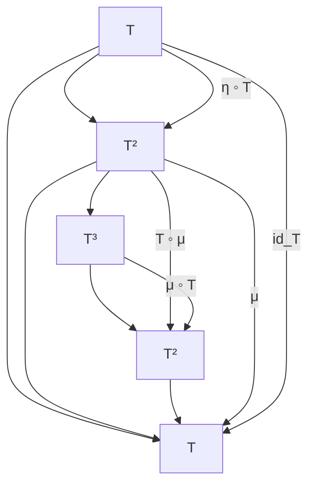

# What are Monads?

## Table of Contents
- [Definition](#definition)
- [Coherence Conditions](#coherence-conditions)
- [Diagrams](#diagrams)
- [Intuition](#intuition)
- [Examples](#examples)
- [Applications](#applications)
- [Relationship to other concepts](#relationship-to-other-concepts)
- [Historical note](#historical-note)
- [Function composition view](#function-composition-view)
- [Maybe example (Haskell)](#maybe-example-haskell)
- [Monad laws (function view)](#monad-laws-function-view)
- [Why this is useful](#why-this-is-useful)

## Definition
In category theory, a monad on a category C consists of three components:

a) An endofunctor T: C → C
b) A natural transformation η: Id_C → T called the "unit"
c) A natural transformation μ: T² → T called the "multiplication"

These components must satisfy two coherence conditions:

## Coherence Conditions
a) Left identity: μ ∘ (η ◦ T) = id_T
b) Right identity: μ ∘ (T ◦ η) = id_T
c) Associativity: μ ∘ (μ ◦ T) = μ ∘ (T ◦ μ)

## Diagrams
These can be expressed as commutative diagrams:



## Intuition
You can think of a monad as a way of adding structure to objects in a category. The endofunctor T represents this added structure, η allows us to embed an object into this structure, and μ allows us to flatten nested levels of this structure.

## Examples
a) In the category of sets:

The powerset functor forms a monad, where η maps an element to its singleton set, and μ flattens a set of sets.
The list functor forms a monad, where η creates a singleton list, and μ concatenates a list of lists.

b) In functional programming:

The Maybe monad represents computations that might fail.
The State monad represents computations with state.
The IO monad represents computations with side effects.

## Applications
Monads are particularly useful in functional programming for:

Handling side effects in a pure functional context
Sequencing computations
Abstracting away common programming patterns

## Relationship to other concepts
Monads can be seen as monoid objects in the category of endofunctors.
They are closely related to adjunctions: every adjunction gives rise to a monad.
They generalize the notion of algebraic structure.

## Historical note
Monads were introduced to computer science by Eugenio Moggi to model computational effects and were popularized in functional programming by Philip Wadler.

## Function composition view
Can you please explain it in terms of function composition?

Certainly! Explaining monads in terms of function composition can provide a more concrete and intuitive understanding, especially for those with a programming background. Let's break it down:

### Basic idea
At its core, a monad is about composing functions that don't quite fit together directly. It provides a way to sequence computations that may have some additional context or effect.

### Components in terms of functions
Let's consider a monad M. In terms of functions, we have:

a) A type constructor M: For any type a, M a is a new type (e.g., Maybe a, List a)
b) A function return (unit): a → M a
c) A function bind (>>=): M a → (a → M b) → M b

### Function composition problem
Normally, if we have functions f: A → B and g: B → C, we can compose them as g ∘ f: A → C.

But what if we have functions that return monadic values?
f: A → M B
g: B → M C

We can't directly compose these because the output of f doesn't match the input of g.

### Monadic composition
This is where the bind operation comes in. It allows us to compose these functions:

(f >=> g) a = f a >>= g

Where (>=>) is the monadic composition operator, often called "Kleisli composition".

### Intuitive explanation
return wraps a value in the monadic context.
bind (>>=) takes a monadic value, extracts the value(s) inside, applies a function to each, and then combines the results.

### Maybe example (Haskell)
```haskell
-- return for Maybe
return x = Just x

-- bind for Maybe
(Just x) >>= f = f x
Nothing >>= f = Nothing

-- Example functions
half :: Int -> Maybe Int
half x = if even x then Just (x `div` 2) else Nothing

addOne :: Int -> Maybe Int
addOne x = Just (x + 1)

-- Composition
halfThenAddOne :: Int -> Maybe Int
halfThenAddOne = half >=> addOne
```
In this example, halfThenAddOne will first try to halve the number, and if successful, will then add one. If halving fails (odd number), the whole computation returns Nothing.

### Monad laws (function view)
The monad laws ensure that monadic composition behaves sensibly:

a) Left identity: return >=> f = f
b) Right identity: f >=> return = f
c) Associativity: (f >=> g) >=> h = f >=> (g >=> h)

These laws ensure that return acts as an identity for monadic composition, and that composition is associative.

### Why this is useful
Monads allow us to:

Chain computations that may fail or have side effects
Abstract away common patterns of computation
Write more modular and composable code

By thinking of monads in terms of function composition, we can see them as a powerful tool for sequencing and combining computations in a flexible and extensible way. This perspective is particularly useful in functional programming, where composing and transforming functions is a fundamental operation.
