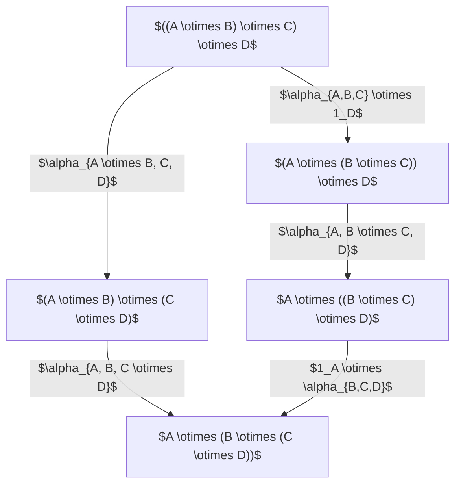
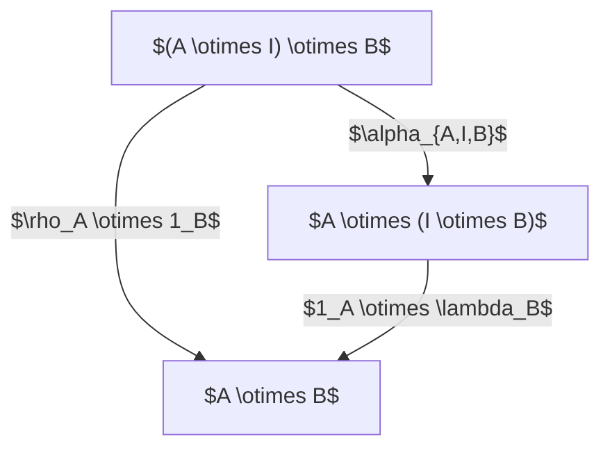
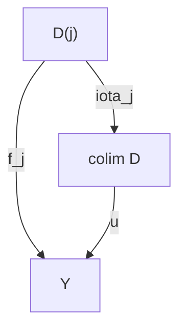

# A Conversation on Category Theory

## Question

When is a category "lax monoidal"?

## Answer

A category is called "lax monoidal" when it is equipped with a tensor product structure that satisfies the monoidal category axioms, but only up to coherent morphisms rather than strict equalities. Let me break this down:

- **Tensor product**: There's a bifunctor $\otimes: C \times C \to C$ (where $C$ is the category).
- **Unit object**: There's a distinguished object $I$ in $C$.
- **Associator**: There's a natural transformation $\alpha: (A \otimes B) \otimes C \to A \otimes (B \otimes C)$ for all objects $A, B, C$.
- **Left and right unitors**: There are natural transformations $\lambda: I \otimes A \to A$ and $\rho: A \otimes I \to A$ for all objects $A$.

The key difference from a strict monoidal category is that in a lax monoidal category:

- The associator $\alpha$ is not required to be an isomorphism.
- The unitors $\lambda$ and $\rho$ are not required to be isomorphisms.
- The coherence conditions (pentagon and triangle identities) are satisfied as commutative diagrams of morphisms, but these morphisms are not necessarily isomorphisms.

This relaxation of the strict equality conditions to mere morphisms is what makes the structure "lax". It's a weaker notion than a strong monoidal category (where $\alpha$, $\lambda$, and $\rho$ are isomorphisms) or a strict monoidal category (where they are identity morphisms).

Lax monoidal categories are important in various areas of mathematics and theoretical computer science, as they capture more general structures where the monoidal operations are only "weakly" compatible.

Would you like me to elaborate on any specific aspect of lax monoidal categories or provide examples?

## Question

Please use latex math for all expressions. What are coherence conditions?

## Answer

Certainly, I'll use LaTeX math notation and explain the coherence conditions for lax monoidal categories.

Coherence conditions are certain diagrams that must commute in a lax monoidal category. These conditions ensure that the associator and unitors behave in a consistent way when composing multiple tensor products. The two main coherence conditions are:

### Pentagon Identity

This condition relates different ways of reassociating a tensor product of four objects. For objects $A$, $B$, $C$, and $D$ in the category, the following diagram must commute:



### Triangle Identity

This condition relates the associator and the unitors. For objects $A$ and $B$, the following diagram must commute:



In these diagrams:

- $\otimes$ is the tensor product
- $I$ is the unit object
- $\alpha$ is the associator: $\alpha_{A,B,C}: (A \otimes B) \otimes C \to A \otimes (B \otimes C)$
- $\lambda$ is the left unitor: $\lambda_A: I \otimes A \to A$
- $\rho$ is the right unitor: $\rho_A: A \otimes I \to A$
- $1_X$ denotes the identity morphism on object $X$

These coherence conditions ensure that all diagrams built from $\alpha$, $\lambda$, and $\rho$ commute, allowing for consistent manipulation of tensor products regardless of the order of operations.

In a lax monoidal category, these diagrams commute, but $\alpha$, $\lambda$, and $\rho$ are not required to be isomorphisms. This is in contrast to strong monoidal categories (where they are isomorphisms) or strict monoidal categories (where they are identity morphisms).

Would you like me to elaborate on any specific part of these coherence conditions or their implications?

## Question

Please use single dollar signs for inline math and double dollar signs for display math, use align environment for multiline equations as needed. Draw commutative diagrams wherever needed. <=== PLEASE REMEMBER THIS INSTRUCTIONS FOR ALL FUTURE CHATS

## Answer

I understand. I'll use single dollar signs for inline math, double dollar signs for display math, the align environment for multiline equations, and draw commutative diagrams as needed. I'll remember these instructions for all future responses. Thank you for the clarification.

To demonstrate this, let me redraw the coherence conditions for lax monoidal categories using the specified formatting:

### Pentagon Identity:

This diagram represents the Pentagon Identity, which ensures consistency when reassociating a tensor product of four objects.


### Triangle Identity:

This diagram represents the Triangle Identity, which relates the associator and the unitors.


In these diagrams:

- $\otimes$ is the tensor product
- $I$ is the unit object
- $\alpha$ is the associator: $\alpha_{A,B,C}: (A \otimes B) \otimes C \to A \otimes (B \otimes C)$
- $\lambda$ is the left unitor: $\lambda_A: I \otimes A \to A$
- $\rho$ is the right unitor: $\rho_A: A \otimes I \to A$
- $1_X$ denotes the identity morphism on object $X$

These coherence conditions ensure that all diagrams built from $\alpha$, $\lambda$, and $\rho$ commute, allowing for consistent manipulation of tensor products regardless of the order of operations.

In a lax monoidal category, these diagrams commute, but $\alpha$, $\lambda$, and $\rho$ are not required to be isomorphisms. This is in contrast to strong monoidal categories (where they are isomorphisms) or strict monoidal categories (where they are identity morphisms).

Is there any part of these coherence conditions or their implications you'd like me to elaborate on?

## Question

Please latex expressions wherever math is present. Even inside artefacts such as mermaid diagrams

## Answer

I apologize for overlooking that detail. You're absolutely right, and I'll make sure to use LaTeX for all mathematical expressions, even within artifacts like Mermaid diagrams. Let me correct that and provide the updated diagrams:

### Pentagon Identity:


### Triangle Identity:


These updated diagrams now properly use LaTeX for all mathematical expressions.

To summarize the key components using inline LaTeX:

- $\otimes$ is the tensor product
- $I$ is the unit object
- $\alpha$ is the associator: $\alpha_{A,B,C}: (A \otimes B) \otimes C \to A \otimes (B \otimes C)$
- $\lambda$ is the left unitor: $\lambda_A: I \otimes A \to A$
- $\rho$ is the right unitor: $\rho_A: A \otimes I \to A$
- $1_X$ denotes the identity morphism on object $X$

These coherence conditions ensure that all diagrams built from $\alpha$, $\lambda$, and $\rho$ commute, allowing for consistent manipulation of tensor products regardless of the order of operations.

In a lax monoidal category, these diagrams commute, but $\alpha$, $\lambda$, and $\rho$ are not required to be isomorphisms. This contrasts with strong monoidal categories (where they are isomorphisms) or strict monoidal categories (where they are identity morphisms).

Thank you for pointing out the need for consistent LaTeX usage. Is there anything else you'd like me to clarify or expand upon regarding lax monoidal categories?
## Question

What are colimits and why do they need to be finite?

## Answer

Colimits are fundamental constructions in category theory that generalize several important concepts from various areas of mathematics. Let's break this down:

### Definition of Colimits

A colimit is a universal cocone for a diagram in a category. More formally:

Given a diagram $D: J \to C$ (where $J$ is a small category and $C$ is the category we're working in), a colimit consists of:

a) An object $\text{colim } D$ in $C$
b) A family of morphisms $(\iota_j: D(j) \to \text{colim } D)_{j \in J}$

such that for any other cocone $(Y, (f_j: D(j) \to Y)_{j \in J})$, there exists a unique morphism $u: \text{colim } D \to Y$ making the following diagram commute for all $j \in J$:



### Why Finite Colimits

Now, to address why we often focus on finite colimits:

a) **Computational feasibility**: Finite colimits involve diagrams indexed by finite categories, making them more manageable to compute and work with in practice.

b) **Existence in many categories**: Many important categories have all finite colimits, but not necessarily all small colimits. For example, the category of finite sets has all finite colimits but not all small colimits.

c) **Relationship to algebraic structures**: Finite colimits are closely related to algebraic operations. For instance, coproducts (a type of colimit) in the category of groups correspond to free products of groups.

d) **Preservation properties**: Functors that preserve finite colimits (finitely cocontinuous functors) are more common and often easier to work with than those preserving all small colimits.

e) **Connection to geometric intuition**: In many geometric contexts, finite colimits correspond to intuitive constructions (e.g., gluing together a finite number of spaces), while infinite colimits can lead to more pathological objects.

f) **Computational complexity**: In computer science and type theory, finite colimits often correspond to data types that can be effectively constructed and manipulated.

### Examples of Finite Colimits

Some important examples of finite colimits include:

- Coproducts (categorical sums)
- Pushouts
- Coequalizers

These can be constructed in many categories and have important applications across mathematics and computer science.

It's worth noting that while finite colimits are often emphasized, infinite colimits are also important in many contexts, particularly in areas like topology, algebra, and category theory itself. The choice to focus on finite or infinite colimits often depends on the specific mathematical context and the properties one wishes to study.

Would you like me to elaborate on any specific aspect of colimits or their finiteness?

## Question

What are diagrams?

## Answer

In category theory, diagrams are a fundamental concept used to represent and study the structure of categories. Let me explain:

### Definition

A diagram in a category $C$ is formally defined as a functor $D: J \to C$, where:

- $J$ is called the **index category** or **shape category**
- $C$ is the category in which we're working

### Intuitive Understanding

Intuitively, a diagram can be thought of as a "picture" or a "pattern" of objects and morphisms in a category. It selects certain objects and morphisms from the category $C$ according to the pattern specified by $J$.

### Examples

Let's look at some common types of diagrams:

**a) Parallel arrows diagram:**

This diagram represents two morphisms with the same domain and codomain:

$A \rightrightarrows B$

Here, $J$ has two objects and two non-identity morphisms between them.

**b) Commutative square:**


Here, $J$ is a category with four objects and four non-identity morphisms forming a square.

**c) Chain diagram:**

This represents a sequence of morphisms:

$A_1 \to A_2 \to A_3 \to \cdots$

The index category $J$ here could be the category of natural numbers with morphisms $i \to j$ whenever $i \le j$.

### Finite vs. Infinite Diagrams

A diagram is called **finite** if its index category $J$ is finite (i.e., has finitely many objects and morphisms). Otherwise, it's called an **infinite diagram**.

### Importance of Diagrams

Diagrams are crucial in category theory for several reasons:

a) They allow us to specify patterns and relationships between objects and morphisms in a precise way.

b) They are used to define universal constructions like limits and colimits.

c) They help in visualizing and understanding complex categorical concepts.

d) They provide a way to compare different categories by looking at how certain diagrams behave in each.

### Diagram Chasing

"Diagram chasing" is a proof technique in category theory where one follows paths in a diagram, using the commutativity of the diagram to establish equalities between compositions of morphisms.

### Diagrams in Other Areas

While we're discussing diagrams in the context of category theory, it's worth noting that similar concepts appear in other areas of mathematics, such as commutative diagrams in algebra or Feynman diagrams in physics.

Would you like me to elaborate on any specific aspect of diagrams or provide more examples of how they're used in category theory?
## Question

Diagrams are like motifs in graph theory?

## Answer

You've made an insightful connection! Yes, diagrams in category theory are indeed analogous to motifs in graph theory. Let's explore this similarity:

### Comparison

- **In graph theory**:
  - A **motif** is a small subgraph or pattern that recurs within larger graphs.
  - Motifs represent characteristic patterns of interconnections.
- **In category theory**:
  - A **diagram** is a "pattern" of objects and morphisms within a larger category.
  - Diagrams represent specific configurations of objects and arrows.

### Key Similarities

**a) Pattern Recognition**:
- Both motifs and diagrams are about identifying specific patterns within larger structures.

**b) Structural Units**:
- Motifs are considered building blocks of complex networks.
- Diagrams are fundamental units for describing categorical structures.

**c) Analysis Tool**:
- In graph theory, studying motifs helps understand network structure and function.
- In category theory, analyzing diagrams helps understand categorical properties and universal constructions.

### Mathematical Formalization

While the intuition is similar, the formal definitions differ:

- **Graph Motif**: Usually defined as a subgraph isomorphism problem.
- **Categorical Diagram**: Formally defined as a functor $D: J \to C$.

### Example Comparison

Let's compare a simple motif in graph theory with a similar diagram in category theory:

```mermaid
graph TD
    subgraph Graph Motif (Triangle)
        A --- B
        B --- C
        C --- A
    end
    subgraph Category Diagram (Commuting Triangle)
        X --> Y
        Y --> Z
        X --> Z
    end
```

### Key Differences

Despite the similarities, there are important differences:

**a) Directionality**:
- Graph motifs often deal with undirected graphs.
- Categorical diagrams typically involve directed morphisms.

**b) Composition**:
- In graphs, edges are usually not composable.
- In categories, morphisms can be composed, which is a crucial aspect of categorical diagrams.

**c) Abstraction Level**:
- Graph motifs are often more concrete, representing specific network patterns.
- Categorical diagrams can represent highly abstract mathematical structures.

### Applications

- **Graph Motifs**: Often used in network biology, social network analysis, etc.
- **Categorical Diagrams**: Used in abstract algebra, topology, programming language theory, etc.

Your observation highlights an important point: many mathematical concepts have analogues across different fields, which can provide valuable insights and intuitions. The similarity between motifs and diagrams showcases how pattern recognition and structural analysis are fundamental across various areas of mathematics.

Would you like to explore more about how this analogy extends to other concepts in graph theory and category theory?
## Question

I've attached a markdown file which contains a copy of our chat so far. Can you organise it into a coherent flow instead of a collection questions and answers?

## Answer

Certainly! I'll reorganize the content into a coherent flow, presenting the information as a structured exploration of lax monoidal categories, colimits, and diagrams in category theory. Here's a more organized version:

(Note: The user indicated this response was not what they wanted, as it was a simple concatenation.)

## Question

No. You are simply concatenating all the responses into one big chunk. That's not what I meant. I want you to go through the answers you've given so far and organise that subject matter in a coherent way, for e.g colimits require an understanding of diagrams. So diagrams should come before colimits in the revised text

## Answer

I apologize for the misunderstanding. You're absolutely right, and I appreciate your guidance. Let me reorganize the content in a more logical and coherent flow, taking into account the dependencies between concepts. I'll structure it so that foundational concepts come before more advanced ones.

(Note: The user then provided a new starting point.)

## Question

Let's start with the following concepts. Span. Cospan. Limits. Colimits. Go!

## Answer

Certainly! I'll provide a coherent exploration of these fundamental concepts in category theory, starting with spans and cospans, then moving on to limits and colimits. This progression will help us understand how these concepts are related and build upon each other.

### Spans, Cospans, Limits, and Colimits in Category Theory

This exploration covers the four concepts you mentioned - spans, cospans, limits, and colimits - in a logical order. We start with the simpler concepts of spans and cospans, which are often used to construct diagrams. Then we move on to the more complex notions of limits and colimits, which are universal constructions defined on diagrams.

The progression allows us to see how these concepts build upon each other:

- Spans and cospans are basic constructions involving three objects and two morphisms.
- Limits and colimits are defined on more general diagrams, which can include spans and cospans as special cases.
- The relationship section at the end ties everything together, showing how spans and cospans relate to specific types of limits and colimits (pullbacks and pushouts).

This structure provides a coherent flow from simpler to more complex ideas, while also highlighting the interconnections between these fundamental category theory concepts. Would you like me to elaborate on any specific part of this explanation?